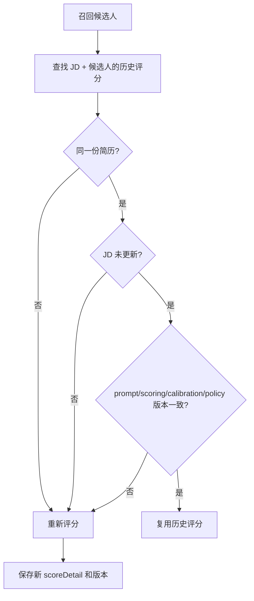

# 候选人评分质量机制

本文说明 JD 筛选里的简历评分如何保持稳定、可解释、可迭代。

Prompt 的统一注册和 LangChain 渲染方式见 [`prompt-management.md`](./prompt-management.md)。

## 一句话版本

评分质量由四层共同保证：

1. 中文证据型 prompt：要求 LLM 只根据 JD 维度和简历事实打分。
2. 岗位类型校准集：根据 JD 自动选择技术、产品、销售等岗位的评分锚点。
3. 版本化复用：历史分数只有在简历、JD 和评分质量版本都一致时才复用。
4. 低成本迭代：默认用回放和单测，不每次真实调 LLM；只有 prompt、模型或校准集变化时跑小样本真实回归。

## 版本化具体怎么做

当前评分结果会把质量版本写进 `scoreDetail`：

| 字段                   | 含义                   | 什么时候需要升级                        |
| ---------------------- | ---------------------- | --------------------------------------- |
| `promptVersion`        | LLM 评估提示词版本     | 改 prompt、输出要求、证据要求           |
| `scoringVersion`       | 本地加权公式和阈值版本 | 改公式、权重、`llmBonus` 范围、动作阈值 |
| `calibrationVersion`   | 岗位类型校准集版本     | 改岗位分类、锚点、各类岗位判断标准      |
| `qualityPolicyVersion` | 评分质量迭代策略版本   | 改回归层级、抽样策略、反馈沉淀规则      |

历史评估复用时，runner 会同时检查：

- 候选人是同一个；
- 简历 `resumeId` 是同一个；
- JD 没有更新；
- 上面四个质量版本都等于当前版本。

只要任一项不一致，就会记录“历史评估已过期”，重新评估当前简历。这样可以避免旧 prompt 或旧校准集下的分数混进新排序。



## 校准集怎么工作

用户不需要一条条手工录入初始校准样本。系统会根据 JD 文本自动推断岗位类型，并给 LLM 一组紧凑的评分锚点。

当前内置岗位类型：

| 类型         | 适用岗位                                  |
| ------------ | ----------------------------------------- |
| `technical`  | 后端、前端、全栈、架构、DevOps 等研发岗位 |
| `data_ai`    | 算法、数据科学、LLM、RAG、AI Agent 等     |
| `product`    | 产品经理、B 端产品、增长产品等            |
| `sales`      | 销售、商务、BD、大客户等                  |
| `operations` | 用户运营、内容运营、活动运营、增长运营等  |
| `design`     | UI、UX、视觉、交互、设计系统等            |
| `management` | 负责人、经理、总监、主管、团队管理等      |
| `general`    | 无法明确归类的通用岗位                    |

每个类型都有四个锚点：

| 锚点     | 动作      | 分数范围 | 用途                           |
| -------- | --------- | -------- | ------------------------------ |
| 强匹配   | `chat`    | 85-100   | 核心证据充分，值得优先联系     |
| 合格匹配 | `chat`    | 70-84    | 多数要求匹配，少量缺口面试确认 |
| 边界匹配 | `collect` | 61-69    | 信息不足或可迁移，先补充材料   |
| 弱匹配   | `skip`    | 0-60     | 核心证据缺失，暂不联系         |

这些锚点会进入 `evaluationSchema.calibrationProfile`，LLM 评分时必须先判断候选人更接近哪个锚点，再给出分项分数。

## 校准集命令

本地提供了一个校准集查看和诊断命令：

```bash
bun run candidate-screening:calibration -- list
bun run candidate-screening:calibration -- show technical
bun run candidate-screening:calibration -- doctor 高级后端工程师 Java Spring Boot 高并发
bun run candidate-screening:calibration -- export sales
```

命令用途：

| 命令                  | 用途                                                    |
| --------------------- | ------------------------------------------------------- |
| `list`                | 查看所有内置岗位类型                                    |
| `show <category>`     | 查看某个岗位类型的强匹配、合格、边界、弱匹配锚点        |
| `doctor <jd text...>` | 输入一段 JD 文本，诊断系统会自动选哪个岗位校准类型      |
| `export <category>`   | 导出完整 JSON profile，方便评审、留档或做 golden sample |

推荐使用方式：

1. 新增或调整一个岗位前，先用 `doctor` 看系统会归到哪个类型。
2. 如果归类不符合预期，优先调整 `src/lib/candidate-screening/calibration.ts` 的类型识别规则。
3. 如果归类正确但评分偏差高，调整对应岗位类型的锚点和 guidance。
4. 锚点或分类变化后，升级 `CANDIDATE_SCREENING_CALIBRATION_VERSION`。
5. 用 `export` 保存当时的 profile，作为回归和评审材料。

## 低成本迭代机制

系统内置三层回归策略：

| 层级                 | 触发                            | LLM 成本   | 做什么                                           |
| -------------------- | ------------------------------- | ---------- | ------------------------------------------------ |
| `replay`             | 每次改评分代码                  | 无         | 用单测和录制输出回放，验证解析、公式、排序、复用 |
| `golden-sample`      | 改 prompt、模型、校准集、rubric | 小样本     | 每类岗位抽 5-10 条强匹配/边界/弱匹配真实调用     |
| `production-monitor` | 每次真实筛选                    | 无额外成本 | 记录分数分布、用户改判、联系和面试结果           |

推荐的迭代节奏：

1. 真实运行后收集用户改判、是否联系、是否回复、面试结果、最终录用结果。
2. 每周按岗位类型复盘误报、漏报和边界样本。
3. 高频错误先沉淀为校准锚点或硬规则，不急着调大 prompt。
4. 只有当规则变化影响评分结果时，升级对应版本号。
5. 版本升级后跑小样本真实回归；通过后再让历史评分自动失效并重评。

## 后续怎么调整

常见修改对应文件：

| 想调整什么                          | 文件                                         |
| ----------------------------------- | -------------------------------------------- |
| 岗位类型识别、默认校准锚点          | `src/lib/candidate-screening/calibration.ts` |
| prompt 文案和输出约束               | `src/lib/candidate-screening/prompts.ts`     |
| 评分公式、`llmBonus` 范围、版本写入 | `src/lib/candidate-screening/scoring.ts`     |
| 历史评分复用判断                    | `src/lib/candidate-screening/runner.ts`      |
| 质量版本常量                        | `src/lib/candidate-screening/constants.ts`   |

版本升级规则：

- 改 prompt：升级 `CANDIDATE_EVALUATION_PROMPT_VERSION`。
- 改公式或阈值：升级 `CANDIDATE_SCREENING_SCORING_VERSION`。
- 改岗位分类或锚点：升级 `CANDIDATE_SCREENING_CALIBRATION_VERSION`。
- 改回归和反馈策略：升级 `CANDIDATE_SCREENING_QUALITY_POLICY_VERSION`。

这样做的好处是：每次改动都能明确影响范围，旧评分不会悄悄污染新结果，也不会为了每次小改动都全量调用 LLM。
