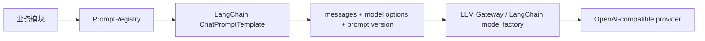

# Prompt 管理机制

本文说明项目里 prompt 现在怎么管理，以及如何继续迁移到更完整的 LangChain / LangGraph prompt 体系。

## 当前状态

项目里历史上有几种 prompt / LLM 调用写法：

- JD agent / chat：使用 LangChain 的 `ChatPromptTemplate`，但版本和调用入口分散。
- candidate screening：先迁移到了 prompt registry，但仍直接 `fetch /chat/completions`。
- candidate communication / `/api/chat`：在调用文件里内联 system prompt 并直接调用 provider。
- workflow learning：LangGraph agent 直接创建 `ChatOpenAI`。

现在统一为两层入口：

- LLM 调用入口：`src/lib/llm/openai-chat.ts` 与 `src/lib/llm/langchain.ts`
- Prompt core：`src/lib/prompt-management/registry.ts` 与 `src/lib/prompt-management/types.ts`
- 应用级 Prompt 装配入口：`src/lib/prompts/app-registry.ts`

业务模块不再直接关心 provider HTTP 细节，也不再把 prompt 文案散落在调用文件里。非 streaming / 非 agent 的 chat completion 通过统一网关调用：

```ts
const response = await invokeLlmChat({
  operation: 'candidate-screening.evaluation',
  prompt: { id: 'candidate-screening.evaluation', version: 'candidate-evaluation-zh-rubric-v2' },
  messages: renderedPrompt.messages,
  temperature: renderedPrompt.options.temperature,
  responseFormat: renderedPrompt.options.responseFormat,
});
```

业务模块通过 prompt id 渲染 prompt：

```ts
const renderedPrompt = await renderManagedPrompt('candidate-screening.evaluation', {
  payload: JSON.stringify(input),
});
```

渲染结果包含：

- `definition.id`
- `definition.version`
- `messages`
- `options.temperature`
- `options.responseFormat`

这样 prompt 的名称、版本、owner、渲染方式和模型选项都在一个地方可查。

当前 registry 覆盖：

| Prompt ID                          | Owner                     | 用途                              |
| ---------------------------------- | ------------------------- | --------------------------------- |
| `chat.assistant`                   | `chat`                    | 通用聊天 / RAG 对话系统提示词     |
| `jd-agent.generate`                | `jd-agent`                | JD 生成                           |
| `jd-agent.evaluate`                | `jd-agent`                | JD 质量评估                       |
| `jd-agent.improve`                 | `jd-agent`                | JD 优化                           |
| `candidate-screening.evaluation`   | `candidate-screening`     | 候选人筛选评分                    |
| `candidate-communication.decision` | `candidate-communication` | 候选人沟通意图、回复和动作决策    |
| `workflow-learning.agent`          | `workflow-learning`       | Workflow Learning LangGraph agent |

## 为什么用这个方式

LangChain 本身提供 `ChatPromptTemplate`、`SystemMessagePromptTemplate`、`HumanMessagePromptTemplate`。这些适合“怎么渲染 prompt”，但项目还需要一层“怎么管理 prompt”：

- 统一列出所有 prompt；
- 每个 prompt 有稳定 id 和 version；
- 记录 owner 和用途；
- 每次 LLM 调用都能把 promptVersion 写入调用元数据或业务结果；
- 后续可以接 LangSmith Prompt Hub 或数据库 Prompt Registry。

因此当前做法是：



## 文件位置

| 内容                          | 文件                                         |
| ----------------------------- | -------------------------------------------- |
| 统一 LLM chat completion 网关 | `src/lib/llm/openai-chat.ts`                 |
| LangChain 模型工厂            | `src/lib/llm/langchain.ts`                   |
| Prompt registry core          | `src/lib/prompt-management/registry.ts`      |
| 应用级 prompt 装配入口        | `src/lib/prompts/app-registry.ts`            |
| 通用 prompt 类型              | `src/lib/prompt-management/types.ts`         |
| JD prompt 定义                | `src/lib/jd-agent/prompts.ts`                |
| Chat prompt 定义              | `src/lib/chat/prompts.ts`                    |
| 候选人评分 prompt 定义        | `src/lib/candidate-screening/prompts.ts`     |
| 候选人沟通 prompt 定义        | `src/lib/candidate-communication/prompts.ts` |
| Workflow Learning prompt 定义 | `src/lib/workflow-learning/prompts.ts`       |

## 新增 prompt 的步骤

1. 在对应业务目录新增 `prompts.ts` 或扩展已有文件。
2. 用 LangChain 的 `ChatPromptTemplate.fromMessages` 定义 prompt。
3. 导出一个 `ManagedPromptDefinition`，必须包含：
   - `id`
   - `version`
   - `owner`
   - `description`
   - `inputVariables`
   - `tags`
   - `chatPrompt`
   - `options`
4. 在 `src/lib/prompts/app-registry.ts` 的 `MANAGED_PROMPTS` 中注册。
5. 业务代码通过 `renderManagedPrompt(id, variables)` 使用。
6. 非 streaming / 非 LangGraph agent 调用通过 `invokeLlmChat` 发送请求。
7. Streaming 或 LangGraph agent 需要模型实例时，通过 `createLangChainChatModel` 创建。
8. 如果 prompt 语义变化会影响结果，升级对应业务版本号。

注意：包含 JSON 示例的 prompt 要用 `templateFormat: 'mustache'`，避免 LangChain 默认 f-string 把 `{}` 当变量解析。

## Prompt 测试与回滚

当前 registry 是代码内静态注册，所以 prompt 变化的质量保证走代码交付链路：

1. 每个 prompt 定义必须有稳定 `id` 和显式 `version`。
2. `src/lib/prompts/app-registry.test.ts` 覆盖应用级注册清单和关键渲染结果，防止 prompt 漏注册、版本缺失或变量渲染坏掉。
3. `src/lib/prompt-management/registry-core.test.ts` 覆盖 core registry 的依赖边界，防止核心 registry 重新 import 业务 prompt。
4. 业务模块测试验证 LLM 调用时会把 `prompt.id`、`prompt.version`、`messages` 和模型选项传给统一网关。
5. 对评分、动作决策这类高风险 prompt，继续使用 golden sample / calibration 流程比较分数、动作和标签漂移。

回滚也按代码版本处理：

- 如果 prompt 文案或变量协议出错，优先 `git revert` 对应 prompt commit，重新部署即可恢复旧 prompt。
- 如果一个业务 prompt 需要保留新旧两版并行灰度，可以在业务 `prompts.ts` 中保留两个 `ManagedPromptDefinition`，在 `src/lib/prompts/app-registry.ts` 注册两个不同 id 或版本化 id，再由业务入口选择版本。
- 业务结果和 LLM observability 都记录 `promptVersion`，所以回滚后可以按版本对比线上效果。

短期不把 prompt 放进数据库热改，是为了保证 prompt 变化都能 code review、测试、随部署回滚。后续如果接 LangSmith Prompt Hub 或数据库 registry，本地 registry 仍应作为 fallback，并保留版本、审批和回归测试门禁。

## LLM 网关策略

`invokeLlmChat` 负责 provider 层的通用治理：

- 统一 OpenAI-compatible `/chat/completions` 请求；
- timeout：默认 `JD_LLM_TIMEOUT_MS`，调用方可传 `timeoutMs` 覆盖；
- JSON mode fallback：provider 明确不支持 `response_format: json_object` 时，自动去掉该参数重发一次；
- transient retry：仅对 `408/409/425/429/5xx`、timeout、网络错误、空响应重试；
- provider fallback：按 `LLM_PROVIDER_ORDER` 在已配置 key 的 provider 间切换，例如 `deepseek,doubao,openai`；
- LangChain model fallback：`createLangChainChatModel` 会为已配置 provider 建立 runtime fallback chain；tool-calling agent 绑定 tools 时会把同一组 tools 绑定到所有 provider；
- circuit breaker：某 provider 连续失败达到阈值后，在冷却窗口内跳过它；
- observability：记录最终 provider/model、retryCount、usage、HTTP status 和 providerAttempts；
- 脱敏：Authorization 始终写为 `Bearer ***`，prompt messages 和 assistant content 只记录长度标记，不直接落原文。

配置示例：

```env
LLM_PROVIDER_ORDER=deepseek,doubao,openai
LLM_MAX_RETRIES=1
LLM_RETRY_BACKOFF_MS=200
LLM_CIRCUIT_BREAKER_FAILURE_THRESHOLD=3
LLM_CIRCUIT_BREAKER_COOLDOWN_MS=60000
DEEPSEEK_API_KEY=...
DEEPSEEK_MODEL=deepseek-chat
DOUBAO_API_KEY=...
DOUBAO_MODEL=...
```

不放在网关里的逻辑：

- 业务 JSON schema 解析失败后的“再问一次”；
- 分数、动作、候选人状态等业务语义错误；
- 可能产生重复副作用的操作重试。

这些必须由业务层判断，因为只有业务知道某次重试是否幂等、是否应该换 prompt、是否应该进入人工复核。

## 与 LangGraph 的关系

LangGraph 管流程状态和节点，PromptRegistry 管 prompt 资产。推荐模式是：

- graph node 负责拿 state；
- node 调用 `renderManagedPrompt`；
- LLM gateway 只接收 `messages` 和 `options`；
- 结果写入 state / DB 时带上 prompt version。

这样节点可以保持可测试，prompt 也能独立测试和版本化。

## 后续可演进方向

当前 registry 是代码内静态注册，优点是简单、可测试、随代码版本走。后续可以平滑升级：

1. 接 LangSmith Prompt Hub：registry 仍保留 id/version，本地定义作为 fallback。
2. 接数据库：允许后台配置 prompt 草稿、灰度版本和审批状态。
3. 接回归命令：对某个 promptVersion 跑 golden sample，比较动作和分数漂移。

短期不建议直接把 prompt 分散到数据库里，否则代码评审、测试和版本复用会变得不透明。
