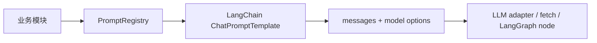

# Prompt 管理机制

本文说明项目里 prompt 现在怎么管理，以及如何继续迁移到更完整的 LangChain / LangGraph prompt 体系。

## 当前状态

项目里历史上有两种 prompt 写法：

- JD agent / chat：使用 LangChain 的 `ChatPromptTemplate`。
- candidate screening：之前在 LLM 调用文件里内联 system prompt 和 user JSON。

现在新增了统一入口：`src/lib/prompt-management/registry.ts`。

业务模块不再直接关心 prompt 由几条 message 组成，而是通过 prompt id 渲染：

```ts
const renderedPrompt = await renderManagedPrompt('candidate-screening.evaluation', {
  payload: JSON.stringify(input),
});
```

渲染结果包含：

- `definition.id`
- `definition.version`
- `messages`
- `options.temperature`
- `options.responseFormat`

这样 prompt 的名称、版本、owner、渲染方式和模型选项都在一个地方可查。

## 为什么用这个方式

LangChain 本身提供 `ChatPromptTemplate`、`SystemMessagePromptTemplate`、`HumanMessagePromptTemplate`。这些适合“怎么渲染 prompt”，但项目还需要一层“怎么管理 prompt”：

- 统一列出所有 prompt；
- 每个 prompt 有稳定 id 和 version；
- 记录 owner 和用途；
- 每次 LLM 调用都能把 promptVersion 写入结果；
- 后续可以接 LangSmith Prompt Hub 或数据库 Prompt Registry。

因此当前做法是：



## 文件位置

| 内容                   | 文件                                     |
| ---------------------- | ---------------------------------------- |
| 统一 registry          | `src/lib/prompt-management/registry.ts`  |
| 通用类型               | `src/lib/prompt-management/types.ts`     |
| 候选人评分 prompt 定义 | `src/lib/candidate-screening/prompts.ts` |
| 候选人评分 LLM 调用    | `src/lib/candidate-screening/llm.ts`     |

## 新增 prompt 的步骤

1. 在对应业务目录新增 `prompts.ts` 或扩展已有文件。
2. 用 LangChain 的 `ChatPromptTemplate.fromMessages` 定义 prompt。
3. 导出一个 `ManagedPromptDefinition`，必须包含：
   - `id`
   - `version`
   - `owner`
   - `description`
   - `inputVariables`
   - `tags`
   - `chatPrompt`
   - `options`
4. 在 `src/lib/prompt-management/registry.ts` 的 `MANAGED_PROMPTS` 中注册。
5. 业务代码通过 `renderManagedPrompt(id, variables)` 使用。
6. 如果 prompt 语义变化会影响结果，升级对应业务版本号。

注意：包含 JSON 示例的 prompt 要用 `templateFormat: 'mustache'`，避免 LangChain 默认 f-string 把 `{}` 当变量解析。

## 与 LangGraph 的关系

LangGraph 管流程状态和节点，PromptRegistry 管 prompt 资产。推荐模式是：

- graph node 负责拿 state；
- node 调用 `renderManagedPrompt`；
- LLM adapter 只接收 `messages` 和 `options`；
- 结果写入 state / DB 时带上 prompt version。

这样节点可以保持可测试，prompt 也能独立测试和版本化。

## 后续可演进方向

当前 registry 是代码内静态注册，优点是简单、可测试、随代码版本走。后续可以平滑升级：

1. 接 LangSmith Prompt Hub：registry 仍保留 id/version，本地定义作为 fallback。
2. 接数据库：允许后台配置 prompt 草稿、灰度版本和审批状态。
3. 接回归命令：对某个 promptVersion 跑 golden sample，比较动作和分数漂移。

短期不建议直接把 prompt 分散到数据库里，否则代码评审、测试和版本复用会变得不透明。
